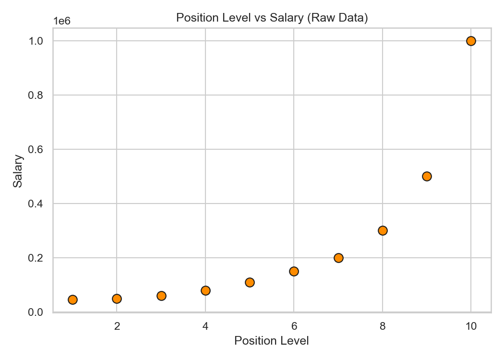
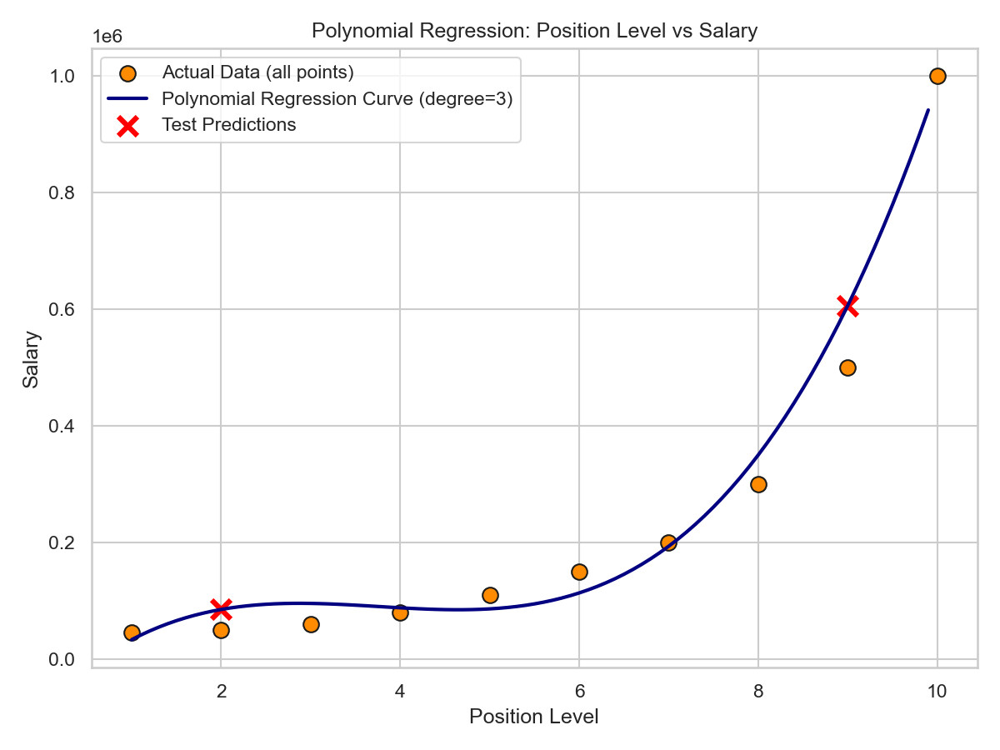

<div align="center">
  <h1>Salary Prediction using Polynomial Regression</h1>
</div>

---

## Objective

Build a Polynomial Regression model that estimates an employee's salary based on their position level, capturing the non-linear jump in salary as seniority increases.

## Dataset Link

Position Salaries Dataset (Kaggle): [Position Salaries Dataset](https://www.kaggle.com/datasets/akram24/position-salaries)

> [!IMPORTANT]
> The dataset is **not** included in this repository. Download `Position_Salaries.csv` from the Kaggle link above and place it in the project's root folder before running the notebook/script.

## Libraries Used

This project was built using the following Python libraries:

| Library | Purpose |
|---|---|
| **`pandas`** | data loading and manipulation |
| **`numpy`** | numerical operations |
| **`matplotlib`** / **`seaborn`** | visualization |
| **`scikit-learn`** | train/test split, Polynomial Features transform, Linear Regression model, evaluation metrics |

Install everything with:
```bash
pip install pandas numpy matplotlib seaborn scikit-learn
```

## Methodology

1. **Data Understanding** — Loaded the dataset with Pandas, inspected the first five records, dataset info, and summary statistics. Identified:
   - Input feature: `Level`
   - Target variable: `Salary`
   *(Note: `Position` is a text label for each level and is dropped from modeling.)*
2. **Data Preprocessing**
   - Checked for missing values (none found).
   - Selected `Level` as the feature and `Salary` as the target.
   - Split the data into 80% training and 20% testing sets.
   - *Note:* This dataset has only 10 rows (one per position level), so the 80/20 split yields just 2 test points — a known characteristic of this classic dataset, not a preprocessing error.
3. **Model Development**
   - Transformed `Level` into polynomial features up to **degree 3** (`Level`, `Level²`, `Level³`) using `PolynomialFeatures`.
   - Trained a `LinearRegression` model on the polynomial features (this is how Polynomial Regression is implemented in scikit-learn).
   - Predicted salaries for the test set.
4. **Model Evaluation**
   - Computed MAE, MSE, and R² Score.
   - Plotted the original data as a scatter plot together with the smooth fitted polynomial regression curve, and marked the test predictions.

## Results

- The degree-3 polynomial curve closely tracks the sharp, accelerating rise in salary at higher position levels — a pattern a straight-line model would clearly underfit.
- Because the dataset only has 10 rows total, the 80/20 split leaves just 2 points for testing, so MAE/MSE/R² should be read as indicative rather than statistically robust; the visual fit of the curve is arguably more informative here than the test-set metrics alone.
- The fitted curve passes close to most of the data points, showing degree 3 has enough flexibility to model the non-linear salary jump without overfitting to the point of oscillating wildly (a risk with much higher degrees on such a small dataset).
- Exact MAE / MSE / R² values are printed when the notebook/script is run against `Position_Salaries.csv` (values will vary slightly depending on the train/test split).

### Model Performance Metrics

| Metric | Value |
|---|---|
| **R² Score** | 0.8763 |
| **Mean Absolute Error (MAE)** | $70,635.25 |
| **Mean Squared Error (MSE)** | 6,263,853,282.86 |

### Visualizations

<div align="center">
  <p><b>Raw Data Visualization</b></p>
  
  <br/><br/>
  <p><b>Polynomial Regression Curve (Degree = 3)</b></p>
  
</div>

## Conclusion

This project used Polynomial Regression (degree 3) to predict employee salaries from position level, capturing the accelerating, non-linear relationship between seniority and pay far better than a straight line could.

**Linear Regression** fits a single straight line and assumes a constant rate of change between feature and target, while **Polynomial Regression** adds powers of the feature (`x²`, `x³`, ...) to bend the fit into a curve, while still being solvable as an ordinary linear least-squares problem on the expanded features.

The key **advantage of Polynomial Regression** for this dataset is its ability to follow the disproportionate jump in salary at senior levels (e.g., Manager → Director → VP → CEO), giving much more accurate estimates at both ends of the position scale than a plain linear fit, which would systematically overestimate junior salaries and underestimate senior ones.

## Repository Structure

```
.
├── Assignment-3.ipynb                # Jupyter notebook version (recommended)
├── Assignment-3.py                   # Plain Python script version
├── README.md                         # Project documentation
├── polynomial_regression_curve.png   # Model fit curve plot
└── position_level_vs_salary_raw.png  # Raw data visualization plot
```

## How to Run

```bash
# 1. Place Position_Salaries.csv (downloaded from Kaggle) in this folder
# 2. Run the notebook
jupyter notebook Assignment-3.ipynb

# OR run the script directly
python Assignment-3.py
```

---

## Student Details

| Field | Details |
|---|---|
| **Name** | Yash Diwan |
| **Registration Number** | 23BCE10154 |
| **Application Number** | IN26010736 |
| **Batch Number** | 2B |
| **Email ID** | yash.23bce10154@vitbhopal.ac.in |

---

<div align="center">
  <p>Made for predictive salary analytics</p>
</div>
